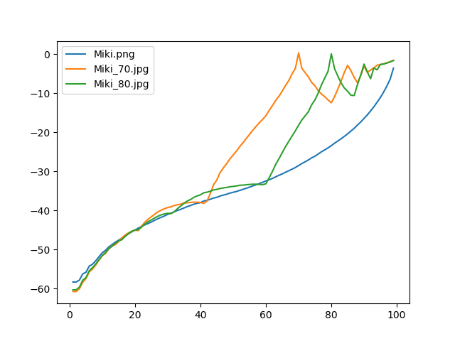
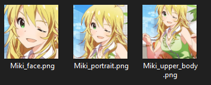
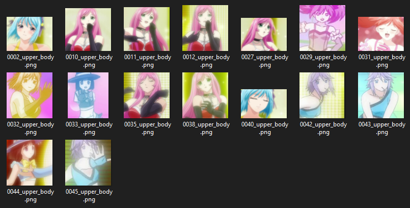

# Image Processing

- [Requirements](#requirements)
- [Jpeg noise analysis](#jpeg-noise-analysis)
- [Face detection](#face-detection)
  - [From images](#from-images)
  - [From videos](#from-videos)
- [Watermark cleaning](#watermark-cleaning)


## Requirements

- os
- sys
- numpy
- PIL
- imutils
- cv2
- tqdm
- Rignak_Misc


###### Face_detection.py specifics

- lbpcascade_animeface

###### jpeg_noise_analysis.py specifics

- scipy


## JPEG noise analysis

This script is used to retrieve the compression value of a .jpg. 

````
> jpeg_noise_analysis.py --help
NAME
    jpeg_noise_analysis.py
    
SYNOPSIS
     jpeg_noise_analysis.py INPUT_FOLDER 
    
POSITIONAL ARGUMENTS
    INPUT_FOLDER
````

###### Example

````
python jpeg_noise_analysis.py input/jpeg_noise
````

*Miki.png* is the source PNG, which was compressed at 0.7 (*Miki_70.jpg*) and 0.8 (*Miki_80.jpg*). Based on the plots, it is possible to retrieve the first local maximum to know the compression of the .jpg.



### Face detection

##### From images

```` 
> python face_detection.py --help
NAME
    face_detection.py - Detect faces and copy them to another folder
    
SYNOPSIS
    face_detection.py <flags> [MODES]...
    
DESCRIPTION
    Detect faces and copy them to another folder
    
POSITIONAL ARGUMENTS
    MODES
        "face", "portrait", "upper_body"
        
FLAGS
    --input_folder=INPUT_FOLDER (required)
        folder containing the images
    --output_folder=OUTPUT_FOLDER (required)
        future folder containing the faces
````

###### Example

```` 
> python face_detection face portrait upper_body
````




##### From videos

```` 
> python face_detection_from_videos.py --help
NAME
    face_detection_from_videos.py - Detect faces from videos and copy them to another folder
    
SYNOPSIS
    face_detection_from_videos.py <flags> [MODES]...
    
DESCRIPTION
    Detect faces and copy them to another folder
    
POSITIONAL ARGUMENTS
    MODES
        "face", "portrait", "upper_body"
        
FLAGS
    --input_folder=INPUT_FOLDER (required)
        folder containing the images
    --output_folder=OUTPUT_FOLDER (required)
        future folder containing the faces
````

###### Example

```` 
> python face_detection_from_videos.py upper_body
````



### Watermark cleaning

```
> cd Watermarking
> python DengekiWatermarking.py
```


